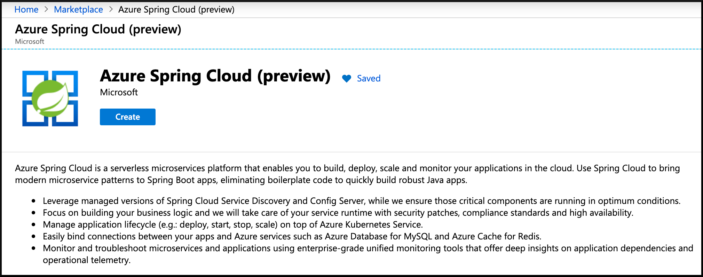
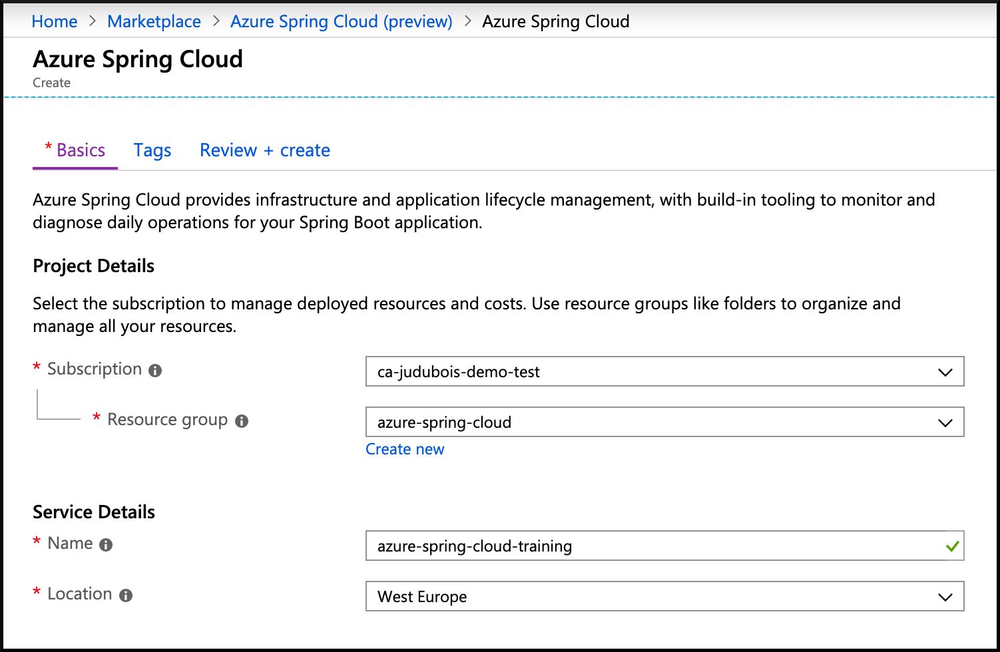

# 01 - クラスタの作成

__このガイドは [Azure Spring Cloud トレーニング](../README.md) のコンテンツの一部です__

本章は、クラスタ作成と、効率的に作業を行うためのコマンドラインによる設定の基本操作についてまとめています。

---

## CLI のインストールと認証

[Azure CLI のインストール](https://docs.microsoft.com/en-us/cli/azure/install-azure-cli/?WT.mc_id=azurespringcloud-github-yoterada) 後、Azure へのログイン

```bash
az login
```

今後のトレーニングで使用する Azure のサブスクリプションの設定

```bash
# すべてのサブスクリプションの一覧表示
az account list -o table

# アクティブにするサブスクリプションの設定
az account set --subscription <target subscription ID>
```

## Azure Spring Cloud CLI エクステンションのインストール

__こちらはプレビュー版における暫定対応です。サービスが正式リリースされたのちは不要となる手順です。__

```bash
az extension add -y --source https://azureclitemp.blob.core.windows.net/spring-cloud/spring_cloud-0.1.0-py2.py3-none-any.whl
```

## Azure Spring Cloud インスタンスの作成

__こちらはプレビュー版における暫定対応です。サービスが正式リリースされたのちは不要となる手順です。__

- Azure Spring Cloud は現在プライベート・プレビューです。  
 [プライベート・プレビューのお試しリクエストはこちらから](https://aka.ms/AzureSpringCloudInterest).
- プライベート・プレビューが利用可能になったのち、クラスタの構築ページにアクセスするために、 [こちらをクリック](https://portal.azure.com/?WT.mc_id=azurespringcloud-github-judubois&microsoft_azure_marketplace_ItemHideKey=AppPlatformExtension#blade/Microsoft_Azure_Marketplace/MarketplaceOffersBlade/selectedMenuItemId/home/searchQuery/spring) してください。



- "Create" ボタンを押下してください
- 適切なサブスクリプション、リソース・グループ名、サービス名、ロケーションを選択してください
- すべてが検証されたのち、クラスタを作成することができます



クラスタの作成には数分の時間を要します。

## クラスタを利用するた目の CLI の設定

ここで、デフォルトで利用するクラスタのリソース・グループ名と名前をあらかじめ設定しておくことで、のちのに実行するコマンドで、数多くの入力を省略することができます。


```bash
az configure --defaults group=<resource group name>
az configure --defaults spring-cloud=<service instance name>
```

---

➡️ 次の章へ: [02 - かんたんな Spring Boot マイクロサービスの構築](../02-build-a-simple-spring-boot-microservice/README.md)
