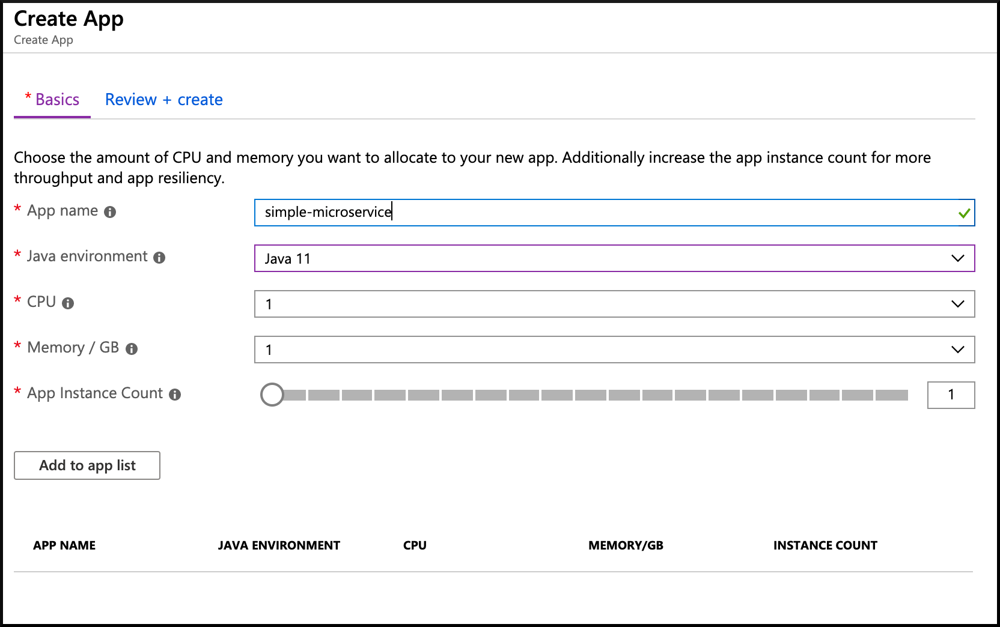

# 02 - かんたんな Spring Boot マイクロサービスの構築

__このガイドは [Azure Spring Cloud training](../README.md) トレーニング のコンテンツの一部です__

本章では、[https://start.spring.io/](https://start.spring.io/) を利用した、できる限りかんたんな Spring Boot マイクロサービスの構築を行います。

---

## かんたんな Spring Boot マイクロサービスの構築

このガイドで構築するマイクロサービスは [こちらからご入手いただけます](./simple-microservice/)。

マイクロサービスを構築するために、コマンド内から [https://start.spring.io/](https://start.spring.io/) を呼び出します。

```bash
curl https://start.spring.io/starter.tgz -d dependencies=web -d baseDir=simple-microservice | tar -xzvf -
```

生成された `simple-microservice` ディレクトリの中をご覧ください。


```bash
cd simple-microservice
```

## 新規 Spring MVC Controller の追加

お好みの統合開発環境 (IDE) でプロジェクトを開き、 `DemoApplication`クラスと同じパッケージの階層上に、` HelloController`という新しいクラスを作成し、下記の内容を記入してください。

```java
package com.example.demo;

import org.springframework.web.bind.annotation.GetMapping;
import org.springframework.web.bind.annotation.RestController;

@RestController
public class HelloController {

    @GetMapping("/hello")
    public String hello() {
        return "Hello from Azure Spring Cloud";
    }
}
```

最終的なプロジェクトの成果物は ["simple-microservice" フォルダ内](simple-microservice/) からご参照頂けます。


## ローカル環境でプロジェクトのテスト

プロジェクトの実行

```bash
./mvnw spring-boot:run
```

curl コマンドから `/hello` のエンドポイントにリクエストを送信すると、"Hello from Azure Spring Cloud" というメッセージが返信されます。

```bash
curl http://127.0.0.1:8080/hello
```

## Azure Spring Cloud 上にアプリケーションの作成とデプロイ

[Azure Portal](https://portal.azure.com/?WT.mc_id=azurespringcloud-github-yoterada) を利用して GUI からアプリケーションを作成することもできます

- リソースグループ内で Azure Spring Cloud クラスターを検索します
- Settings から　"App" を選択し　”Create App” を押下します
- "App name" に　"simple-microservice" を入力し作成します



また、CLI (コマンドライン) からも作成でき、こちらの方がより簡単です。

```bash
az spring-cloud app create -n simple-microservice
```

以上で、「simple-microservice」プロジェクトをビルドして、Azure Spring Cloud に送信できるようになります。

```bash
./mvnw package
az spring-cloud app deploy -n simple-microservice --jar-path target/demo-0.0.1-SNAPSHOT.jar
```

## クラウド環境上でプロジェクトのテスト

[Azure Portal](https://portal.azure.com/?WT.mc_id=azurespringcloud-github-yoterada) にアクセスしてください。

- リソースグループ内で Azure Spring Cloud クラスターを検索します
- "Settings" の "App" を選択し "simple-microservice" のリンクを押下してください
- "Test Endpoint" の項目に、テスト用接続 URL が記載されていますので、コピーしてください。

コピーしたのち、cURL コマンドを利用して、コピーした URL に /hello のエンドポイントを付け加えてアクセスしてください。Azure Spring Cloud 上で処理が実行されます。


## まとめ

おめでとうございます！！  
最初の Spring Boot マイクロサービスを Azure Spring Cloud 上にデプロイできました！

仮に、ソースコードを確認したい場合、プロジェクトの最終成果物は ["simple-microservice" フォルダ内](simple-microservice/) にございますので、どうぞごちらからご確認ください。

下記に、この章で実施してたビルドからデプロイのすべてを行う最終的なスクリプトを記載します。どうぞ、下記をご参照ください。

```
curl https://start.spring.io/starter.tgz -d dependencies=web -d baseDir=simple-microservice | tar -xzvf -
cd simple-microservice
cat > HelloController.java << EOF
package com.example.demo;

import org.springframework.web.bind.annotation.GetMapping;
import org.springframework.web.bind.annotation.RestController;

@RestController
public class HelloController {

    @GetMapping("/hello")
    public String hello() {
        return "Hello from Azure Spring Cloud";
    }
}
EOF
mv HelloController.java src/main/java/com/example/demo/HelloController.java
az spring-cloud app create -n simple-microservice
./mvnw package
az spring-cloud app deploy -n simple-microservice --jar-path target/demo-0.0.1-SNAPSHOT.jar
```

---

⬅️ 前章: [01 - クラスタの作成](../01-create-a-cluster/README.md)

➡️ 次章: [03 - アプリケーション・ログの設定](../03-configure-application-logs/README.md)
