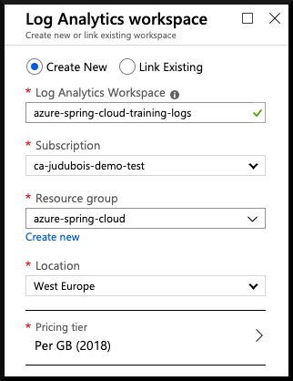
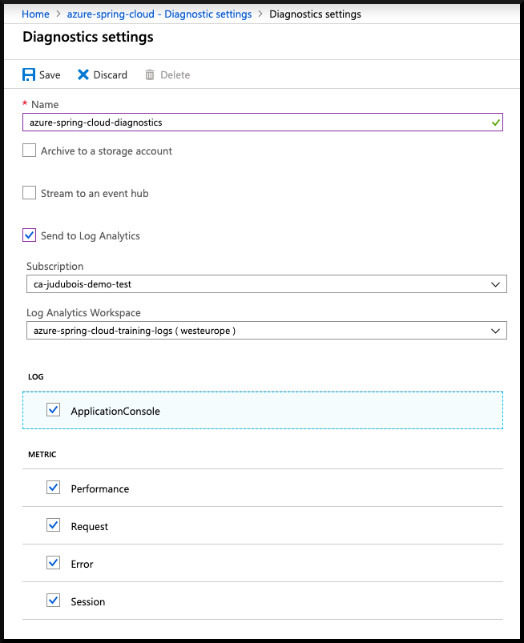
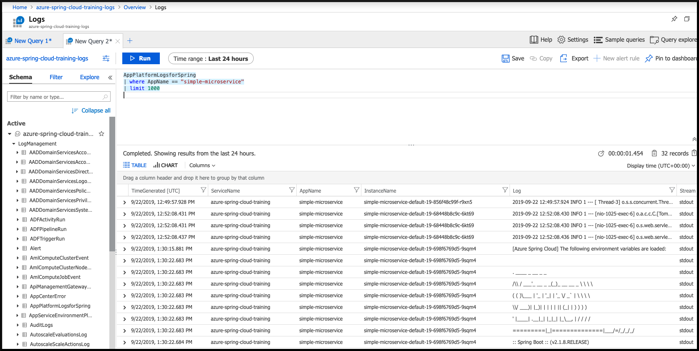

# 03 - アプリケーション・ログの設定

__このガイドは  [Azure Spring Cloud training](../README.md) トレーニング のコンテンツの一部です__

一般的な課題を理解するために、Spring Boot アプリケーションのログへのアクセス

---

## ログの集約に関する設定

アプリケーションのログにアクセスするには、下記の 3 種類があります。  

* [Azure Storage](https://docs.microsoft.com/en-us/azure/storage/common/storage-introduction/?WT.mc_id=azurespringcloud-github-yoterada)  
* [Azure Events Hub](https://docs.microsoft.com/en-us/azure/event-hubs/?WT.mc_id=azurespringcloud-github-yoterada)  
* [Log Analytics](https://docs.microsoft.com/en-us/azure/azure-monitor/log-query/get-started-portal/?WT.mc_id=azurespringcloud-github-yoterada) 

ここでは、最も一般的であり、Azure Spring Cloud に統合されている　Log Analytics を利用します。

[Log Analytics](https://docs.microsoft.com/en-us/azure/azure-monitor/log-query/get-started-portal/?WT.mc_id=azurespringcloud-github-yoterada) は Azure Monitor の一部で、Azure Spring Cloud にうまく統合されており、メトリックの監視にも役立ちます。

- [Azure Portal](https://portal.azure.com/?WT.mc_id=azurespringcloud-github-judubois) にアクセスしてください
- 検索ボックスより "Log Analytics workspaces" を検索してください
- Azure Spring Cloud が含まれるリソース・グループ内に新規ワーク・スペースを作成してください



- Now that the Log analytics workspace has been created, we must configure our Azure Spring Cloud cluster instance to send its data to this workspace.
- Go to the "Overview" page of your Azure Spring Cloud cluster, and select "Diagnostic settings" in the menu.
- Click on "Add diagnostic setting" and configure your cluster to send all its logs to the Log analytics workspace that we just created.



## Query application logs

Logs are now available in the "Logs" menu of you Azure Spring Cloud cluster.

This is a shortcut to the Logs Analytics workspace that was created earlier, so you can access that workspace through both menus.

This workspace allows to do queries on the aggregated logs, the most common one being to get the latest log from a specific application:

__Important:__ Spring Boot applications logs have a dedicated `AppPlatformLogsforSpring` type.

As we called the application in the [previous guide](../02-build-a-simple-spring-boot-microservice/README.md) "simple-microservice", here is how to get its 50 most recent logs of the `AppPlatformLogsforSpring` type for this application:

```
AppPlatformLogsforSpring
| where AppName == "simple-microservice"
| limit 50
```



---

⬅️ Previous guide: [02 - Build a simple Spring Boot microservice](../02-build-a-simple-spring-boot-microservice/README.md)

➡️ Next guide: [04 - Configure a Spring Cloud Config server](../04-configure-a-spring-cloud-config-server/README.md)
