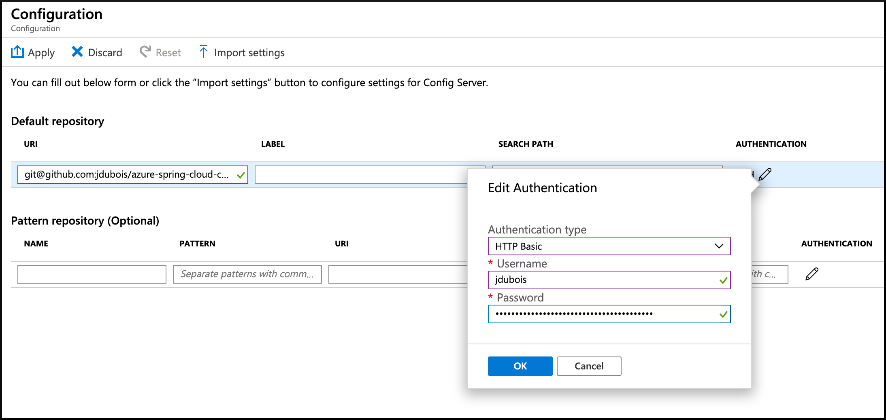

# 04 - Spring Cloud Config Server の設定

__このガイドは  [Azure Spring Cloud training](../README.md) トレーニング のコンテンツの一部です__

[Spring Cloud Config Server](https://cloud.spring.io/spring-cloud-config) は Azure Spring Cloud で完全に管理およびサポートされ、Spring Boot のマイクロサービスで利用されます。

---

> If you want to skip this section, you can use the following public Git repository [https://github.com/jdubois/spring-cloud-config-public.git](https://github.com/jdubois/spring-cloud-config-public.git)

> このセクションをスキップしたい場合、次の公開 Git リポジトリ ([https://github.com/jdubois/spring-cloud-config-public.git](https://github.com/jdubois/spring-cloud-config-public.git)) を利用できます
 

## アプリケーションの設定を保存するための　Git リポジトリを作成

On your [GitHub account](https://github.com), create a new **private** repository where the Spring Boot configurations will be stored.

[GitHubアカウント]（https://github.com）で、Spring Boot の設定を保存する新規**プライベート**リポジトリを作成してください。

> 設定情報の保存内容については、パブリックで公開すべきでないため、プライベートリポジトリを作成することをお勧めします

作成したリポジトリに `application.yml` 新規ファイルを追加してください。YAML ファイル中には、すべてのマイクロサービスの設定データを記載します。下記の例では、設定の成功の可否を検証するメッセージを保存しています。


```yaml
application:
    message: Configured by Azure Spring Cloud
```

## GitHub のパーソナルトークンの作成

Azure Spring Cloud から、パブリックに公開されている、HTTP の Basic 認証もしくは SSH でセキュアに接続可能な Git のレポジトリに対してアクセスができます。


Follow the [GitHub guide to create a personal token](https://help.github.com/en/articles/creating-a-personal-access-token-for-the-command-line) and save your token, as we will use it in the next section.

[GitHub のガイド：パーソナルトークンの作成方法](https://help.github.com/en/articles/creating-a-personal-access-token-for-the-command-line) に従い、トークンを保存し、次のセクションで使用します。


## Azure Spring Cloud から Git リポジトリに接続するための設定

- まず、[Azure Portal](https://portal.azure.com/?WT.mc_id=azurespringcloud-github-yoterada) に接続してください
- 次に、Azure Spring Cloud サーバの概要ページにアクセスし、メニューから "Config Server" を選択してください。
- 上記で作成したレポジトリ設定:
  - レポジトリ URL の追加、例 `https://github.com/jdubois/azure-spring-cloud-config.git`
  - `Authentication` をクリックし、`HTTP Basic` を選択
  - Username は　GitHub のログイン名です。
  - Password はo 前のセクションで作成したパーソナル・トークンです。
- "Apply" をクリックし、操作の完了までお待ちください。



---

⬅️ 前章: [03 - アプリケーション・ログの設定](../03-configure-application-logs/README.md)

➡️ 次章: [05 - Spring Cloud の機能を利用した Spring Boot マイクロサービスの構築](../05-build-a-spring-boot-microservice-using-spring-cloud-features/README.md)
